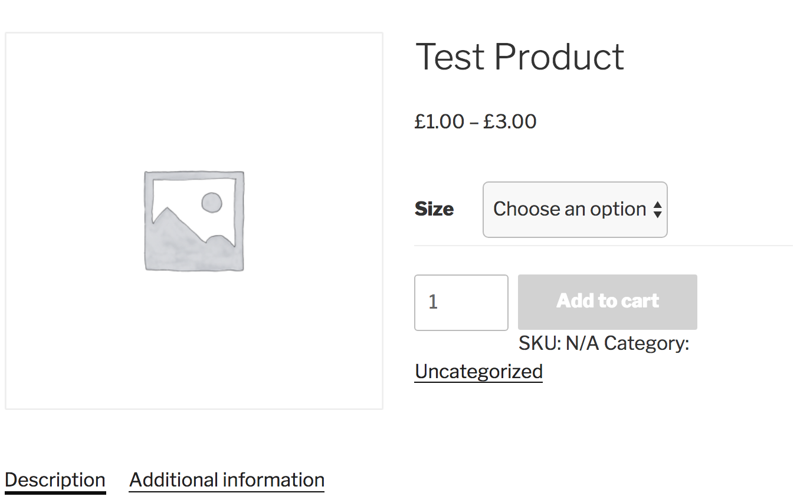
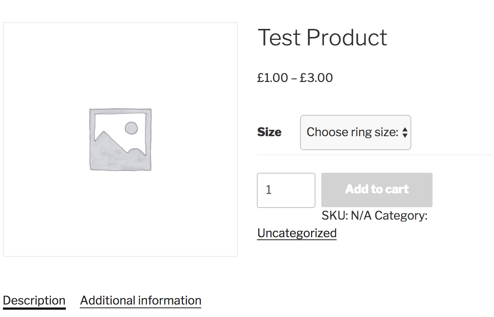

# WooCommerce Variation Dropdown Customiser

A Wordpress plugin that allows you to customise the dropdown text that by default reads "Choose an option".

## Instructions:

1. Install and activate the plugin.
2. Choose the alternative text you would like to be displayed instead of "choose an option".
3. (Optional) Select the checkbox to automatically insert the attribute name after the dropdown text. 
4. Save changes.

## Before:

## After:

